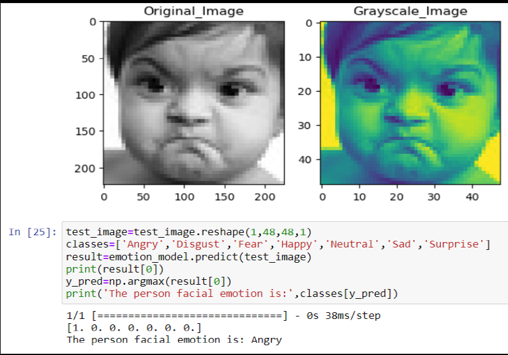
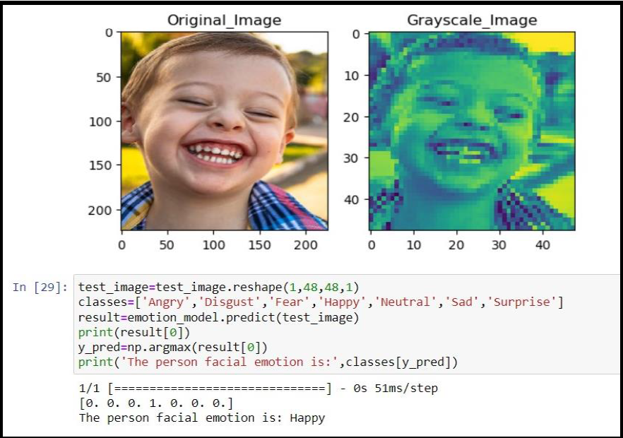

# Facial Emotion Detection Using CNN

## Overview
This project implements a **Facial Emotion Detection system** using **Convolutional Neural Networks (CNNs)**.  
The model is trained to recognize human emotions from facial expressions and can be applied in areas such as **human–computer interaction, mental health analysis, security systems, and user behavior analysis**.

---

## Dataset: FER2013
The **FER2013** dataset is a widely used benchmark dataset for facial expression recognition tasks.

- **Total images**: 35,887 grayscale facial images  
- **Image size**: 48 × 48 pixels  
- **Emotion classes (7)**:
  - Angry
  - Disgust
  - Fear
  - Happy
  - Neutral
  - Sad
  - Surprise

The dataset was collected from the internet and contains diverse facial expressions, making it suitable for training robust deep learning models.

---

## Installation

### 1. Clone the repository
```bash
git clone https://github.com/Lonishubh48/facial-emotion-detection-using-CNN.git
cd facial-emotion-detection-using-CNN
```

2. Install the required packages:
pip install -r requirements.txt
# Usage
3. Load the Dataset: Ensure the FER2013 dataset is properly structured in the training and testing directories.

# Train the Model:
4. Run the training script to build and train the CNN model:
# Code snippet to train the model
    emotion_model_info = emotion_model.fit_generator(
    train_generator,
    steps_per_epoch=28709 // 64,
    epochs=15,
    validation_data=validation_generator,
    validation_steps=7178 // 64)

## CNN Architecture

The Convolutional Neural Network (CNN) used for facial emotion recognition consists of the following components:

### Input Layer
- **Input Shape**: (48, 48, 1)  
- Grayscale facial images

### Convolutional Layers
- **Conv Layer 1**: 32 filters, 3×3 kernel, ReLU activation  
- **Conv Layer 2**: 64 filters, 3×3 kernel, ReLU activation  
- **Conv Layer 3**: 128 filters, 3×3 kernel, ReLU activation  
- **Conv Layer 4**: 128 filters, 3×3 kernel, ReLU activation  

### Pooling Layers
- **MaxPooling Layers** with pool size (2×2) applied after convolution blocks

### Regularization
- **Dropout Layers** with 25% dropout to reduce overfitting

### Fully Connected Layers
- **Dense Layer 1**: 1024 units, ReLU activation  
- **Dense Layer 2**: 512 units, ReLU activation  

### Output Layer
- **7 units** (one for each emotion class)  
- **Softmax activation** for multi-class classification

This architecture effectively learns spatial features and emotion-specific patterns from facial expressions.


## Results and Visualizations
The model's accuracy and loss during training are plotted for evaluation.
Feature maps from the first convolutional layer are visualized to understand what the model is learning.

### Sample Emotion Predictions



# Model Saving
The trained model is saved as facial_emotions_detection_model.h5 for future use.

# Contributing
Contributions are welcome!

